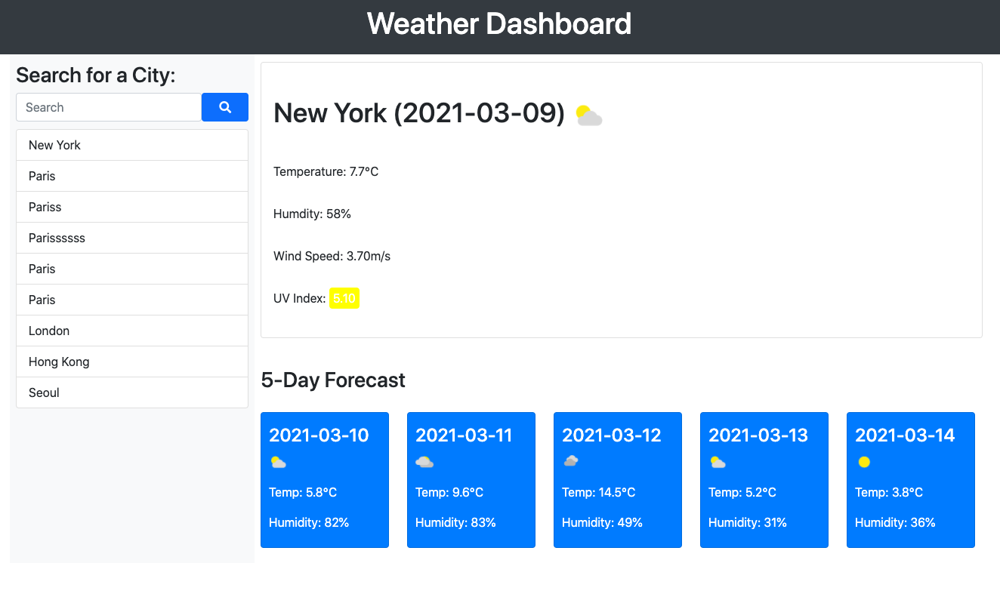

# Columbia University Bootcamp Week 6 Homework: Weather Dashboard

## Introduction
This repo is my sixth homework for my Columbia Bootcamp. I completed the following:
1. I created a weather dashboard from scratch where users can search by city name.
2. I made server side API calls from https://api.weatherbit.io to get the weather forecasts.
3. I used JQuery to make the website interactive.
4. I used bootstrap to layout and style the HTML page and also made it responsive. 
5. I stored all the past search keywords into local storage.
6. I used geolocation to get the weather of the current location of the browser.

Screenshot:

## Technology
* HTML
* CSS
* JS
* Jquery
* Bootstrap
* https://api.weatherbit.io

## Link to Deployed Site
https://byung90.github.io/columbia-week6-homework/

## License
[MIT](https://choosealicense.com/licenses/mit/)